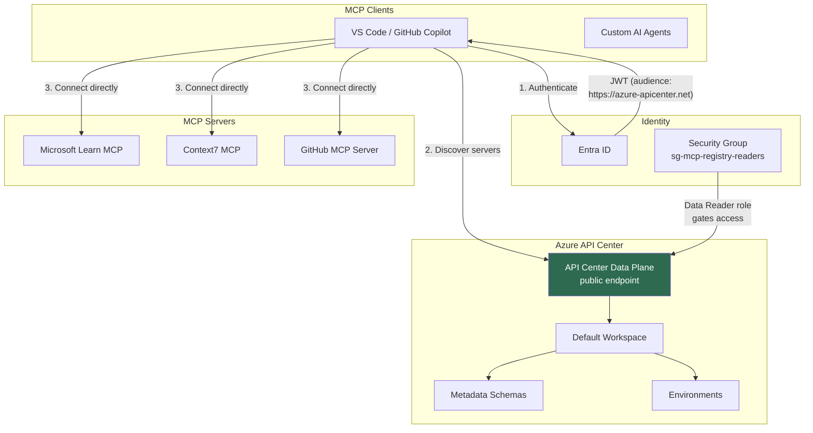
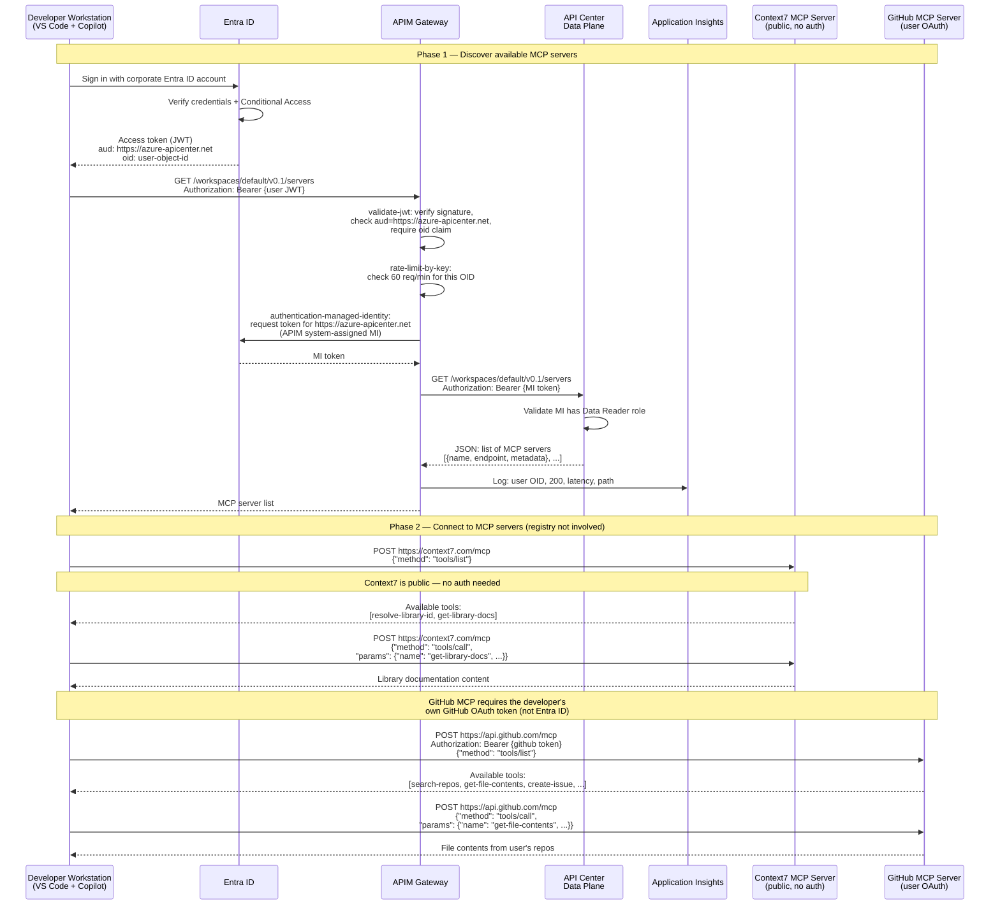
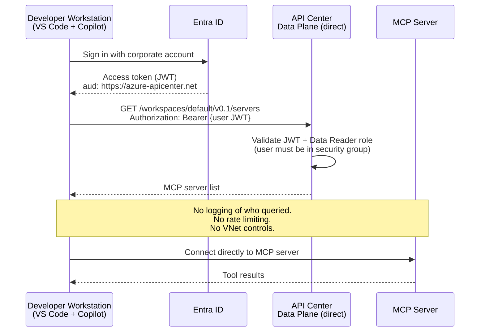
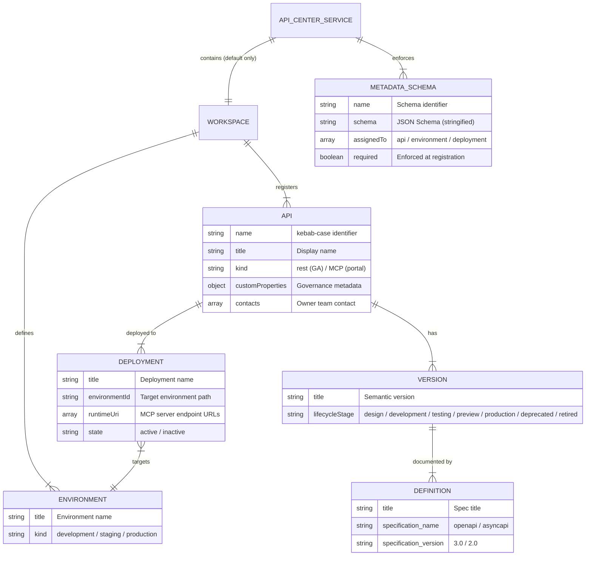
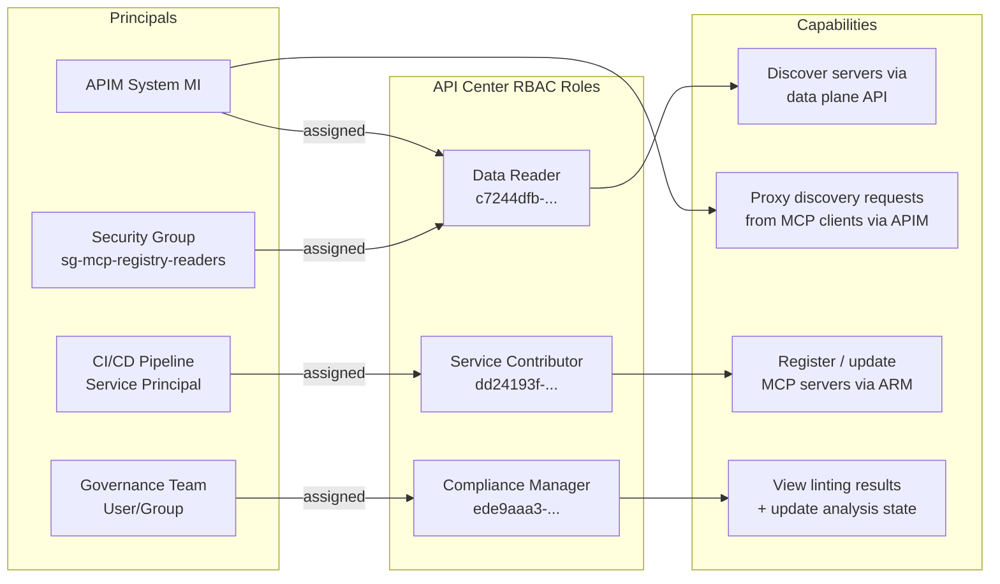
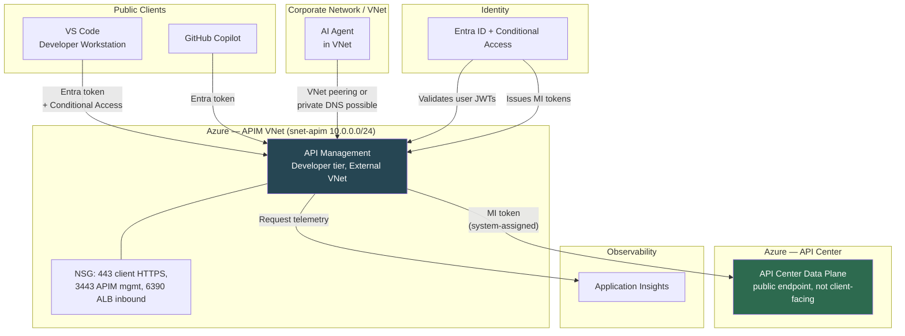
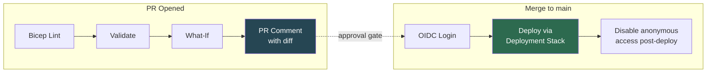
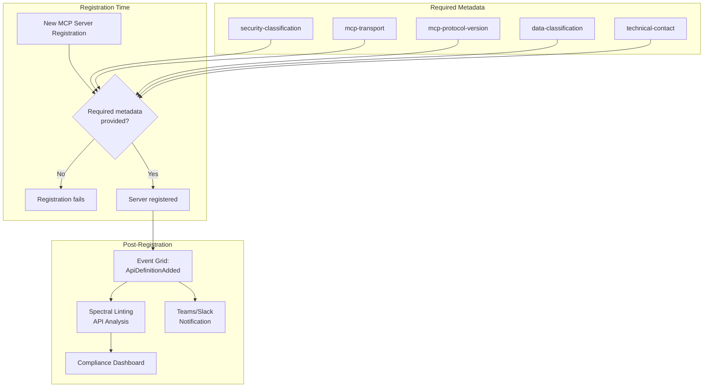

# Architecture — Azure API Center MCP Server Registry

## Solution overview

Azure API Center serves as a **centralized MCP server registry** implementing the MCP Registry v0.1 specification. The registry is an **enterprise allowlist for GitHub Copilot MCP servers** — controlling which MCP servers are available to developers, starting with public-information servers (Microsoft Learn, Context7) and scaling to credential-bearing servers (GitHub) and custom enterprise servers.

There are two key concepts to understand:

1. **Discovery** — MCP clients query the registry to find out which servers exist and where they live. This is what the registry provides.
2. **Runtime** — MCP clients connect directly to each server for tool invocation. The registry is not in the runtime path.

API Center handles discovery and governance. The MCP servers themselves run independently (Container Apps, Functions, VMs, external SaaS, etc.) and are not proxied through API Center.

## Architecture comparison

This project supports two deployment topologies. The current deployment uses the full architecture with APIM.

### Simplified architecture (API Center direct)

The minimum viable deployment for an MCP registry. MCP clients authenticate directly to the API Center data plane using Entra ID tokens. Suitable when logging, rate limiting, and VNet integration are not required.



**What you get:** Entra ID authentication, security group gating, governance metadata enforcement.

**What you don't get:** Request logging, per-user rate limiting, VNet integration, observability into who queried the registry.

### Full architecture with APIM proxy (current deployment)

Azure API Management (Developer tier, External VNet mode) sits in front of the API Center data plane, adding per-user rate limiting, request logging to Application Insights, VNet integration, and a hybrid auth pattern where APIM validates the user's identity but uses its own managed identity to call the backend.

```mermaid
graph TB
    subgraph "MCP Clients"
        VSC[VS Code / GitHub Copilot]
        AIF[Azure AI Foundry]
        CA[Custom AI Agents]
    end

    subgraph "Identity & Access"
        EID[Entra ID]
        SG[Security Group<br/>sg-mcp-registry-readers]
        CAP[Conditional Access Policies]
    end

    subgraph "APIM Proxy Layer"
        APIM[API Management<br/>Developer tier, External VNet]
        VNET[VNet: {name}-vnet<br/>Subnet: snet-apim 10.0.0.0/24]
        APIM --- VNET
    end

    subgraph "Azure API Center — MCP Registry"
        APIC[API Center Service<br/>backend, not client-facing]
        WS[Default Workspace]
        META[Metadata Schemas<br/>governance enforcement]
        ENV[Environments<br/>development]

        APIC --> WS
        WS --> META
        WS --> ENV
    end

    subgraph "MCP Servers (runtime)"
        LEARN[Microsoft Learn MCP]
        CTX7[Context7 MCP]
        GH[GitHub MCP Server]
        CUSTOM[Custom Enterprise MCP Servers]
    end

    subgraph "Observability"
        APPI[Application Insights<br/>request/response logging]
        AL[Activity Log]
        EG[Event Grid]
    end

    VSC -->|"1. Discover servers<br/>(Entra ID token)"| APIM
    AIF -->|"1. Discover servers<br/>(Entra ID token)"| APIM
    CA -->|"1. Discover servers<br/>(managed identity token)"| APIM

    APIM -->|"Validate JWT, rate limit<br/>then forward with MI token"| APIC

    SG -->|"Members authenticate<br/>via Entra ID"| APIM
    EID -->|"Bearer token"| APIM
    CAP -->|"Enforce device/location"| EID

    VSC -->|"2. Connect directly<br/>(tools/list, tools/call)"| LEARN
    VSC -->|"2. Connect directly"| CTX7
    VSC -->|"2. Connect directly<br/>(user OAuth)"| GH
    CA -->|"2. Connect directly"| CUSTOM

    APIM -->|"Request telemetry"| APPI
    APIC -->|"ARM audit"| AL
    APIC -->|"Registration events"| EG
```

**What APIM adds over the simplified architecture:**

| Capability | Simplified (direct) | Full (APIM proxy) |
|---|---|---|
| Authentication | User JWT validated by API Center | User JWT validated by APIM, MI token used for backend |
| Rate limiting | None (undocumented platform limits only) | 60 req/min per user OID |
| Request logging | None (API Center has no diagnostic settings) | All requests logged to Application Insights with user OID |
| VNet integration | None (API Center has no network controls) | APIM in dedicated subnet with NSG |
| Latency | Single hop | Additional hop through APIM (~10-50ms) |
| Cost | Free (API Center only) | ~$50/month (Developer tier APIM) |

## End-to-end sequence: developer discovers and uses MCP servers

This diagram shows the complete flow from a developer's workstation through registry discovery to MCP server tool invocation.



Key points illustrated above:

- **The registry is only involved in Phase 1 (discovery).** Once the client has the server list, it connects directly to each MCP server.
- **Each MCP server handles its own authentication.** Public servers like Context7 need no auth. Credential-bearing servers like GitHub use the developer's own OAuth tokens. The registry does not broker or proxy these connections.
- **APIM sees who queried the registry but not what happens after.** The runtime traffic between the developer and MCP servers is invisible to the registry infrastructure.

## Simplified sequence: direct API Center access (no APIM)

For comparison, this is how the flow works without the APIM proxy layer — clients talk directly to the API Center data plane.



This works but provides no observability. You cannot answer "who queried the registry last week?" or "is anyone hitting it excessively?" — which is why the APIM proxy was added.

## Data model mapping



## RBAC model



## Network access model



## CI/CD pipeline flow



> **Note:** Initial deployments that include APIM provisioning take 30-45 minutes. The Deployment Stack timeout may need to be increased. Subsequent updates to existing APIM instances are much faster.

## Governance enforcement


